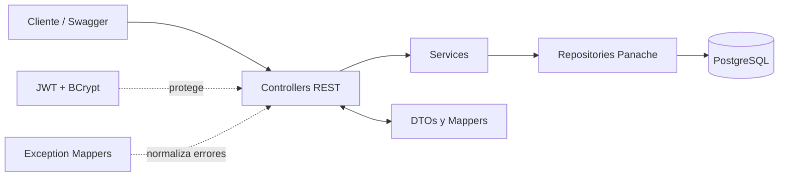
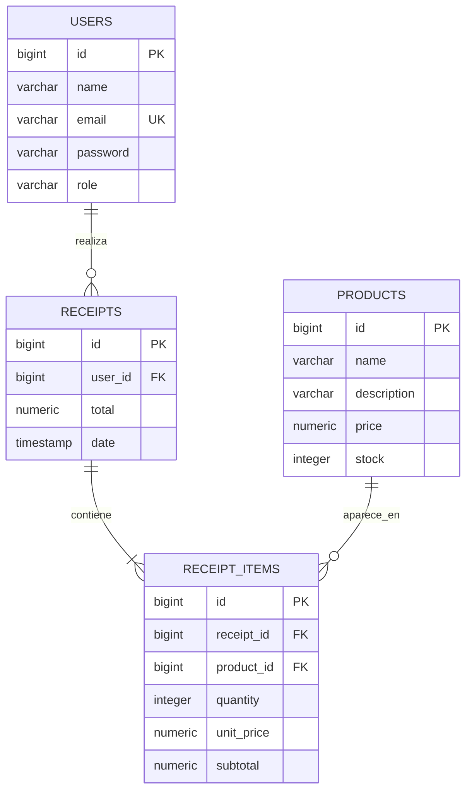

# E-commerce REST API — EPN | Grupo 1


API RESTful para gestionar el flujo transaccional de un comercio electrónico: registro y autenticación de usuarios, administración de inventario y generación de notas de venta.

El proyecto fue desarrollado por el **Grupo 1 de la Escuela Politécnica Nacional** con el stack asignado: **Java 21, Quarkus, Hibernate ORM con Panache, PostgreSQL, JWT y OpenAPI**.

> **Uso académico:** proyecto final de Backend Multitecnología — Escuela Politécnica Nacional.

---

## Tabla de contenidos

- [Características](#características)
- [Stack tecnológico](#stack-tecnológico)
- [Arquitectura](#arquitectura)
- [Modelo de datos](#modelo-de-datos)
- [Estructura del proyecto](#estructura-del-proyecto)
- [Requisitos previos](#requisitos-previos)
- [Ejecución con Docker](#ejecución-con-docker-recomendado)
- [Ejecución en modo desarrollo](#ejecución-en-modo-desarrollo)
- [Base de datos y script SQL](#base-de-datos-y-script-sql)
- [Autenticación y roles](#autenticación-y-roles)
- [Documentación Swagger/OpenAPI](#documentación-swaggeropenapi)
- [Endpoints](#endpoints)
- [Flujo de prueba](#flujo-de-prueba)
- [Validaciones y manejo de errores](#validaciones-y-manejo-de-errores)
- [Pruebas automatizadas](#pruebas-automatizadas)
- [Comandos útiles](#comandos-útiles)
- [Solución de problemas](#solución-de-problemas)
- [Integrantes](#integrantes)

---

## Características

- Registro de usuarios con contraseña protegida mediante **BCrypt**.
- Inicio de sesión y autorización mediante **JWT firmado con RSA**.
- Roles `USER` y `ADMIN` con permisos diferenciados.
- Administrador inicial creado automáticamente al arrancar la aplicación.
- CRUD de usuarios y productos.
- Búsqueda y paginación de productos.
- Creación transaccional de notas de venta.
- Validación de existencia de usuarios y productos.
- Validación y descuento automático de stock.
- Cálculo de subtotales y total exclusivamente en el backend con `BigDecimal`.
- DTOs y mappers para evitar exponer entidades y contraseñas.
- Manejo centralizado de errores con respuestas JSON uniformes.
- Documentación interactiva con Swagger UI y OpenAPI.
- **17 endpoints REST** y **21 pruebas automatizadas**.
- Despliegue reproducible con Docker Compose.

### Reglas de negocio principales

1. El cliente envía únicamente el usuario, los productos y sus cantidades; no envía el total.
2. La API comprueba que el usuario y todos los productos existan.
3. La API verifica que exista stock suficiente para cada producto.
4. El precio unitario se toma de la base de datos.
5. El backend calcula cada subtotal y el total de la nota de venta.
6. El stock se descuenta dentro de la misma transacción.
7. Si cualquier validación falla, la transacción se revierte y no se registra una compra parcial.

---

## Stack tecnológico

| Área | Tecnología |
|---|---|
| Lenguaje | Java 21 |
| Framework | Quarkus 3.15.1 |
| API REST | RESTEasy Reactive + Jackson |
| Persistencia | Hibernate ORM con Panache, patrón Repository |
| Base de datos | PostgreSQL 15 |
| Validación | Hibernate Validator / Jakarta Bean Validation |
| Seguridad | SmallRye JWT, llaves RSA y BCrypt |
| Documentación | SmallRye OpenAPI + Swagger UI |
| Pruebas | JUnit 5, REST-Assured y `@QuarkusTest` |
| Contenedores | Docker y Docker Compose |
| Build | Maven Wrapper |

---

## Arquitectura

El proyecto utiliza una arquitectura por capas para separar las responsabilidades HTTP, la lógica de negocio, el acceso a datos y la persistencia.



### Responsabilidad de cada capa

| Capa | Responsabilidad |
|---|---|
| `controller` | Expone los endpoints, recibe DTOs y devuelve códigos HTTP. |
| `service` | Implementa reglas de negocio y transacciones. |
| `repository` | Realiza el acceso a datos mediante Panache. |
| `entity` | Modela las tablas y relaciones JPA. |
| `dto` | Define contratos de entrada y salida sin exponer información sensible. |
| `mapper` | Convierte entidades a DTOs y viceversa. |
| `security` | Genera JWT y cifra/verifica contraseñas. |
| `exception` | Centraliza errores de validación, negocio y recursos inexistentes. |
| `config` | Configura OpenAPI y crea el administrador inicial. |

---

## Modelo de datos

El dominio obligatorio está compuesto por cuatro entidades: `User`, `Product`, `Receipt` y `ReceiptItem`.



`ReceiptItem` conserva el precio unitario y el subtotal registrados al momento de la compra. De esta manera, el historial de una nota de venta no cambia aunque posteriormente se modifique el precio del producto.

---

## Estructura del proyecto

```text
ecommerce-api/
├── .mvn/
│   └── wrapper/                         # Configuración de Maven Wrapper
├── src/
│   ├── main/
│   │   ├── docker/                      # Dockerfiles de Quarkus
│   │   ├── java/ec/epn/ecommerce/
│   │   │   ├── config/                  # OpenAPI y AdminSeeder
│   │   │   ├── controller/              # Endpoints REST
│   │   │   ├── dto/                     # DTOs de entrada, salida y errores
│   │   │   ├── entity/                  # Entidades JPA
│   │   │   ├── exception/               # Excepciones y ExceptionMapper
│   │   │   ├── mapper/                  # Conversión Entity <-> DTO
│   │   │   ├── repository/              # Repositorios Panache
│   │   │   ├── security/                # JWT y BCrypt
│   │   │   └── service/                 # Reglas de negocio y transacciones
│   │   └── resources/
│   │       ├── META-INF/branding/        # Personalización de Swagger UI
│   │       ├── application.properties   # Configuración de la aplicación
│   │       ├── privateKey.pem            # Llave RSA de firma
│   │       └── publicKey.pem             # Llave RSA de verificación
│   └── test/java/ec/epn/ecommerce/       # Pruebas JUnit + REST-Assured
├── .dockerignore
├── .gitignore
├── docker-compose.yml                    # API + PostgreSQL
├── Dockerfile                            # Build multietapa alternativo
├── mvnw                                  # Maven Wrapper para Linux/macOS
├── mvnw.cmd                              # Maven Wrapper para Windows
├── pom.xml
└── README.md
```

---

## Requisitos previos

### Opción recomendada: Docker

- Docker Desktop.
- Docker Compose, incluido en Docker Desktop.
- Puertos disponibles: `8080` para la API y `5432` para PostgreSQL.

### Opción local

- JDK 21.
- PostgreSQL 15.
- No es necesario instalar Maven globalmente porque el repositorio incluye Maven Wrapper.

Para comprobar Docker en Windows PowerShell:

```powershell
docker --version
docker compose version
docker info
```

`docker info` debe mostrar tanto la sección **Client** como la sección **Server**. Si únicamente aparece el cliente, se debe iniciar Docker Desktop.

---

## Ejecución con Docker (recomendado)

Desde una terminal ubicada en la carpeta que contiene `docker-compose.yml`:

```powershell
docker compose up --build -d
```

El proceso crea y levanta dos servicios:

| Servicio | Contenedor | Puerto | Función |
|---|---|---:|---|
| `postgres-db` | `ecommerce-postgres` | `5432` | Base de datos PostgreSQL 15. |
| `quarkus-api` | `ecommerce-api` | `8080` | API Quarkus. |

Comprobar el estado:

```powershell
docker compose ps
docker compose logs -f quarkus-api
```

Cuando el log muestre que Quarkus inició correctamente, abrir:

- API base: <http://localhost:8080>
- Swagger UI: <http://localhost:8080/q/swagger-ui/>
- OpenAPI: <http://localhost:8080/openapi>

Para detener los servicios sin borrar los datos:

```powershell
docker compose down
```

Para detener los servicios y eliminar también el volumen de PostgreSQL:

```powershell
docker compose down -v
```

> **Advertencia:** `docker compose down -v` elimina permanentemente la base de datos almacenada en el volumen del proyecto.

---

## Ejecución en modo desarrollo

La configuración local espera PostgreSQL en `localhost:5432`, base `ecommerce_db`, usuario `ecommerce_user` y contraseña `ecommerce_password`.

Se puede levantar únicamente PostgreSQL con Docker:

```powershell
docker compose up -d postgres-db
```

Después, ejecutar Quarkus desde Windows:

```powershell
.\mvnw.cmd quarkus:dev
```

En Linux o macOS:

```bash
./mvnw quarkus:dev
```

El modo desarrollo habilita recarga automática y la consola de Quarkus en:

<http://localhost:8080/q/dev/>

---

## Base de datos y script SQL

### Creación automática del esquema

La aplicación utiliza Hibernate ORM y actualmente tiene configurado:

```properties
quarkus.hibernate-orm.database.generation=update
```

Por esta razón, al iniciar la API, Hibernate crea o actualiza automáticamente las tablas a partir de las entidades JPA. El volumen `postgres_data` de Docker Compose conserva la información entre reinicios.

> El proyecto no utiliza actualmente Flyway ni Liquibase. Para que el esquema sea explícito, reproducible y verificable como parte de la entrega, se incluye a continuación el script PostgreSQL equivalente.

### Script PostgreSQL de referencia

Ejecutar sobre una base de datos vacía llamada `ecommerce_db`:

```sql
-- =============================================================
-- E-commerce API - EPN Grupo 1
-- Esquema compatible con PostgreSQL 15
-- =============================================================

CREATE TABLE IF NOT EXISTS users (
    id       BIGSERIAL PRIMARY KEY,
    name     VARCHAR(100) NOT NULL,
    email    VARCHAR(100) NOT NULL UNIQUE,
    password VARCHAR(255) NOT NULL,
    role     VARCHAR(20) NOT NULL DEFAULT 'USER',
    CONSTRAINT chk_users_role CHECK (role IN ('USER', 'ADMIN'))
);

CREATE TABLE IF NOT EXISTS products (
    id          BIGSERIAL PRIMARY KEY,
    name        VARCHAR(150) NOT NULL,
    description VARCHAR(500),
    price       NUMERIC(10, 2) NOT NULL,
    stock       INTEGER NOT NULL,
    CONSTRAINT chk_products_price CHECK (price > 0),
    CONSTRAINT chk_products_stock CHECK (stock >= 0)
);

CREATE TABLE IF NOT EXISTS receipts (
    id      BIGSERIAL PRIMARY KEY,
    user_id BIGINT NOT NULL,
    total   NUMERIC(10, 2) NOT NULL,
    date    TIMESTAMP NOT NULL DEFAULT CURRENT_TIMESTAMP,
    CONSTRAINT fk_receipts_user
        FOREIGN KEY (user_id) REFERENCES users(id)
        ON UPDATE CASCADE ON DELETE RESTRICT,
    CONSTRAINT chk_receipts_total CHECK (total >= 0)
);

CREATE TABLE IF NOT EXISTS receipt_items (
    id         BIGSERIAL PRIMARY KEY,
    receipt_id BIGINT NOT NULL,
    product_id BIGINT NOT NULL,
    quantity   INTEGER NOT NULL,
    unit_price NUMERIC(10, 2) NOT NULL,
    subtotal   NUMERIC(10, 2) NOT NULL,
    CONSTRAINT fk_receipt_items_receipt
        FOREIGN KEY (receipt_id) REFERENCES receipts(id)
        ON UPDATE CASCADE ON DELETE CASCADE,
    CONSTRAINT fk_receipt_items_product
        FOREIGN KEY (product_id) REFERENCES products(id)
        ON UPDATE CASCADE ON DELETE RESTRICT,
    CONSTRAINT chk_receipt_items_quantity CHECK (quantity > 0),
    CONSTRAINT chk_receipt_items_unit_price CHECK (unit_price > 0),
    CONSTRAINT chk_receipt_items_subtotal CHECK (subtotal > 0)
);

CREATE INDEX IF NOT EXISTS idx_receipts_user_id
    ON receipts(user_id);

CREATE INDEX IF NOT EXISTS idx_receipt_items_receipt_id
    ON receipt_items(receipt_id);

CREATE INDEX IF NOT EXISTS idx_receipt_items_product_id
    ON receipt_items(product_id);

CREATE INDEX IF NOT EXISTS idx_products_name_lower
    ON products(LOWER(name));
```

También se puede ejecutar desde el contenedor:

```powershell
Get-Content .\schema.sql -Raw |
  docker exec -i ecommerce-postgres psql -U ecommerce_user -d ecommerce_db
```

> El usuario administrador no debe insertarse con una contraseña en texto plano. `AdminSeeder` lo crea al iniciar la aplicación y almacena su contraseña cifrada con BCrypt.

---

## Autenticación y roles

La aplicación usa JWT firmado con RSA. El token incluye el identificador, correo, nombre y rol del usuario, y tiene una duración de **2 horas**.

Los endpoints protegidos requieren el encabezado:

```http
Authorization: Bearer <TOKEN>
```

### Administrador inicial

Si no existe, `AdminSeeder` crea automáticamente un usuario administrador al iniciar la API.

| Campo | Valor de desarrollo |
|---|---|
| Correo | `admin@epn.edu.ec` |
| Contraseña | `ChangeMe123!` |
| Rol | `ADMIN` |

> Estas credenciales son únicamente para desarrollo y demostración. Deben cambiarse antes de desplegar la aplicación fuera de un entorno académico controlado.

### Matriz de permisos

| Recurso | Público | `USER` | `ADMIN` |
|---|:---:|:---:|:---:|
| Registro e inicio de sesión | ✅ | ✅ | ✅ |
| Consultar productos | ✅ | ✅ | ✅ |
| Crear, actualizar o eliminar productos | ❌ | ❌ | ✅ |
| Crear una nota de venta | ❌ | ✅ | ❌ |
| Listar notas de venta | ❌ | ✅ | ❌ |
| Consultar/eliminar notas específicas | ❌ | ❌ | ✅ |
| Consultar y actualizar usuarios | ❌ | ✅ | ❌ |
| Eliminar usuarios o cambiar roles | ❌ | ❌ | ✅ |

> La tabla refleja las anotaciones de seguridad implementadas actualmente en los controladores.

### Consideraciones de seguridad

- Las contraseñas se almacenan con BCrypt, costo 12.
- Ningún DTO de respuesta expone el campo `password`.
- Los totales y precios efectivos se calculan en el servidor.
- Para un despliegue real, las llaves RSA y credenciales deben gestionarse como secretos externos y no versionarse en Git.
- Las credenciales de PostgreSQL incluidas son valores de desarrollo y deben sustituirse en producción.

---

## Documentación Swagger/OpenAPI

Con la aplicación ejecutándose:

- **Swagger UI:** <http://localhost:8080/q/swagger-ui/>
- **Especificación OpenAPI:** <http://localhost:8080/openapi>

### Autorizar solicitudes en Swagger

1. Ejecutar `POST /api/auth/login` con un usuario válido.
2. Copiar el valor `token` de la respuesta.
3. Presionar el botón **Authorize** en Swagger UI.
4. Ingresar el token en el esquema de autenticación.
5. Ejecutar los endpoints permitidos para el rol del usuario.

---

## Endpoints

URL base local: `http://localhost:8080`

### Autenticación

| Método | Endpoint | Acceso | Descripción | Respuesta exitosa |
|---|---|---|---|---:|
| `POST` | `/api/auth/login` | Público | Autentica un usuario y devuelve un JWT. | `200` |

### Usuarios

| Método | Endpoint | Acceso | Descripción | Respuesta exitosa |
|---|---|---|---|---:|
| `POST` | `/api/users/register` | Público | Registra un usuario con rol `USER`. | `201` |
| `GET` | `/api/users` | `USER` | Lista los usuarios. | `200` |
| `GET` | `/api/users/{id}` | `USER` | Obtiene un usuario por identificador. | `200` |
| `PUT` | `/api/users/{id}` | `USER` | Actualiza nombre y correo. | `200` |
| `DELETE` | `/api/users/{id}` | `ADMIN` | Elimina un usuario. | `204` |
| `PUT` | `/api/users/{id}/role` | `ADMIN` | Cambia el rol a `USER` o `ADMIN`. | `200` |

### Productos

| Método | Endpoint | Acceso | Descripción | Respuesta exitosa |
|---|---|---|---|---:|
| `GET` | `/api/products` | Público | Lista productos; admite búsqueda y paginación. | `200` |
| `GET` | `/api/products/{id}` | Público | Obtiene un producto por identificador. | `200` |
| `POST` | `/api/products` | `ADMIN` | Crea un producto. | `201` |
| `PUT` | `/api/products/{id}` | `ADMIN` | Actualiza un producto. | `200` |
| `DELETE` | `/api/products/{id}` | `ADMIN` | Elimina un producto. | `204` |

Parámetros disponibles en `GET /api/products`:

| Parámetro | Tipo | Predeterminado | Descripción |
|---|---|---:|---|
| `search` | `string` | vacío | Filtra por nombre sin distinguir mayúsculas y minúsculas. |
| `page` | `integer` | `0` | Índice de página, comenzando en cero. |
| `size` | `integer` | `10` | Número de resultados solicitados. |

Ejemplo:

```http
GET /api/products?search=mouse&page=0&size=5
```

### Notas de venta

| Método | Endpoint | Acceso | Descripción | Respuesta exitosa |
|---|---|---|---|---:|
| `POST` | `/api/receipts` | `USER` | Crea una nota, calcula el total y descuenta stock. | `201` |
| `GET` | `/api/receipts` | `USER` | Lista todas las notas de venta. | `200` |
| `GET` | `/api/receipts/{id}` | `ADMIN` | Obtiene una nota por identificador. | `200` |
| `GET` | `/api/receipts/user/{userId}` | `ADMIN` | Lista las notas de un usuario. | `200` |
| `DELETE` | `/api/receipts/{id}` | `ADMIN` | Elimina una nota de venta. | `204` |

---

## Flujo de prueba

La forma más sencilla de probar el sistema es Swagger UI. También se puede usar `curl`; en PowerShell se recomienda invocar `curl.exe`.

### 1. Registrar un usuario

```powershell
curl.exe -X POST "http://localhost:8080/api/users/register" `
  -H "Content-Type: application/json" `
  -d '{"name":"Juan Pérez","email":"juan@epn.edu.ec","password":"password123"}'
```

### 2. Iniciar sesión como administrador

```powershell
curl.exe -X POST "http://localhost:8080/api/auth/login" `
  -H "Content-Type: application/json" `
  -d '{"email":"admin@epn.edu.ec","password":"ChangeMe123!"}'
```

Respuesta esperada:

```json
{
  "token": "eyJhbGciOiJSUzI1NiIs..."
}
```

### 3. Crear un producto con el token de administrador

```powershell
curl.exe -X POST "http://localhost:8080/api/products" `
  -H "Content-Type: application/json" `
  -H "Authorization: Bearer <TOKEN_ADMIN>" `
  -d '{"name":"Mouse inalámbrico","description":"Mouse USB","price":25.50,"stock":10}'
```

### 4. Iniciar sesión con el usuario registrado

```powershell
curl.exe -X POST "http://localhost:8080/api/auth/login" `
  -H "Content-Type: application/json" `
  -d '{"email":"juan@epn.edu.ec","password":"password123"}'
```

### 5. Crear una nota de venta con el token del usuario

```powershell
curl.exe -X POST "http://localhost:8080/api/receipts" `
  -H "Content-Type: application/json" `
  -H "Authorization: Bearer <TOKEN_USER>" `
  -d '{"userId":1,"items":[{"productId":1,"quantity":2}]}'
```

El backend toma el precio almacenado, calcula el subtotal y el total, registra la nota y reduce el stock dentro de una única transacción.

---

## Validaciones y manejo de errores

Los DTOs aplican validaciones como:

- campos obligatorios;
- formato válido de correo;
- contraseña de mínimo 6 caracteres;
- nombre y descripción con longitudes máximas;
- precio mayor que cero;
- stock no negativo;
- cantidad mínima de compra igual a 1;
- rol limitado a `USER` o `ADMIN`.

Las excepciones son transformadas por `ExceptionMapper` en una respuesta JSON uniforme:

```json
{
  "timestamp": "2026-07-19T12:00:00",
  "status": 404,
  "error": "Resource Not Found",
  "message": "Producto no encontrado con ID: 99",
  "path": "api/products/99"
}
```

### Códigos HTTP utilizados

| Código | Significado |
|---:|---|
| `200 OK` | Consulta o actualización exitosa. |
| `201 Created` | Usuario, producto o nota creada. |
| `204 No Content` | Eliminación exitosa. |
| `400 Bad Request` | Datos inválidos, credenciales incorrectas o stock insuficiente. |
| `401 Unauthorized` | Token inexistente o inválido. |
| `403 Forbidden` | El rol no tiene permiso para la operación. |
| `404 Not Found` | El recurso solicitado no existe. |
| `500 Internal Server Error` | Error inesperado controlado por el mapper global. |

---

## Pruebas automatizadas

El proyecto contiene **21 métodos de prueba** con JUnit 5, REST-Assured y `@QuarkusTest`:

| Suite | Pruebas | Casos principales |
|---|---:|---|
| `AuthEndpointTest` | 5 | Login correcto, administrador inicial, contraseña incorrecta, correo inexistente y DTO inválido. |
| `ProductEndpointTest` | 8 | Lectura pública, autorización, CRUD, validaciones, búsqueda y paginación. |
| `ReceiptEndpointTest` | 4 | Compra exitosa, total y stock, stock insuficiente, usuario inexistente y eliminación inexistente. |
| `UserEndpointTest` | 4 | Registro correcto, correo duplicado, datos inválidos y campos faltantes. |
| **Total** | **21** | |

La configuración de pruebas usa PostgreSQL local en el puerto `5432`. Primero se debe levantar la base de datos:

```powershell
docker compose up -d postgres-db
.\mvnw.cmd test
```

En Linux o macOS:

```bash
docker compose up -d postgres-db
./mvnw test
```

> Las pruebas actuales se conectan a `ecommerce_db`. Se recomienda utilizar una base separada si se desean conservar datos manuales de demostración.

---

## Comandos útiles

```powershell
# Construir y levantar todo
docker compose up --build -d

# Ver los servicios del proyecto
docker compose ps

# Seguir los logs de la API
docker compose logs -f quarkus-api

# Ver los logs de PostgreSQL
docker compose logs -f postgres-db

# Reiniciar únicamente la API
docker compose restart quarkus-api

# Detener los servicios conservando datos
docker compose down

# Ejecutar las pruebas en Windows
.\mvnw.cmd test

# Compilar en Windows
.\mvnw.cmd clean package
```

---

## Solución de problemas

### Docker responde solo como cliente

Si `docker info` muestra un error al conectarse a `dockerDesktopLinuxEngine`, iniciar Docker Desktop y esperar a que el motor esté listo.

### El puerto 5432 ya está ocupado

Comprobar qué contenedor usa el puerto:

```powershell
docker ps --format "table {{.Names}}\t{{.Status}}\t{{.Ports}}"
```

Detener únicamente el contenedor que está ocupando `5432` o cambiar el puerto externo en `docker-compose.yml`, por ejemplo:

```yaml
ports:
  - "5433:5432"
```

Si se ejecuta Quarkus fuera de Docker con ese cambio, también se debe actualizar la URL JDBC local para usar `localhost:5433`.

### El puerto 8080 ya está ocupado

Detener el servicio que utiliza el puerto o cambiar el mapeo de la API:

```yaml
ports:
  - "8081:8080"
```

En ese caso, Swagger quedará disponible en `http://localhost:8081/q/swagger-ui/`.

### Swagger abre, pero los endpoints protegidos responden 401 o 403

- `401`: falta el token o el token es inválido/expiró.
- `403`: el token es válido, pero el rol no tiene autorización para ese endpoint.
- Volver a ejecutar `/api/auth/login`, copiar el nuevo token y usar **Authorize**.

### Reiniciar completamente la base de datos

```powershell
docker compose down -v
docker compose up --build -d
```

> Este procedimiento elimina todos los datos guardados en el volumen.

---

## Correspondencia con los entregables

| Entregable | Evidencia en el repositorio |
|---|---|
| Código fuente organizado | Arquitectura por capas dentro de `src/main/java/ec/epn/ecommerce`. |
| Estructura de carpetas | Documentada en este README. |
| Persistencia | Entidades JPA, repositorios Panache y PostgreSQL 15. |
| Migración o script de base de datos | Generación Hibernate `update` y script PostgreSQL incluidos en este README. |
| Instrucciones de ejecución | Docker Compose y modo desarrollo documentados. |
| Endpoints | Catálogo completo de los 17 endpoints y permisos. |
| Swagger/OpenAPI | Rutas de acceso y procedimiento de autorización documentados. |
| Validaciones y errores | Bean Validation y `ExceptionMapper` centralizados. |
| Seguridad | JWT RSA, BCrypt y roles `USER`/`ADMIN`. |
| Pruebas | 21 pruebas JUnit + REST-Assured distribuidas en 4 suites. |
| Valor agregado | Docker, filtros, paginación, roles y pruebas automatizadas. |

---

## Integrantes

**Escuela Politécnica Nacional — Grupo 1**

- José Castro
- Estefano Santacruz
- Anna Nevenchenaia
