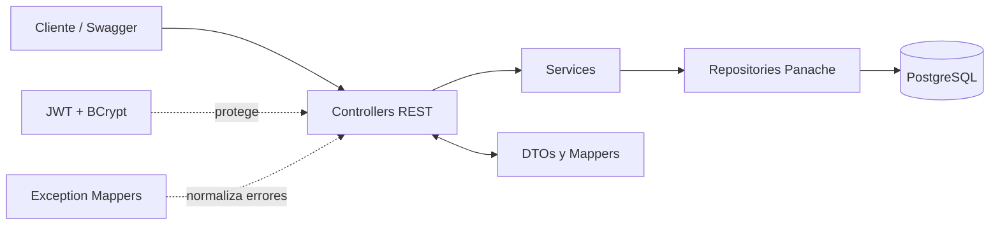
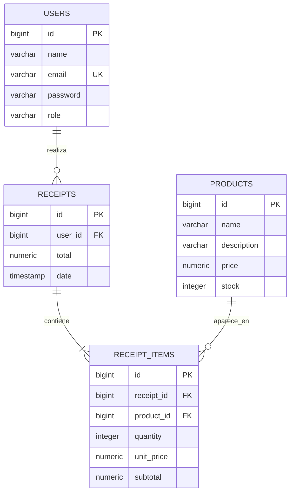

# E-commerce REST API — EPN | Grupo 1


API RESTful para gestionar el flujo transaccional de un comercio electrónico: registro y autenticación de usuarios, administración de inventario y generación de notas de venta.

El proyecto fue desarrollado por el **Grupo 1 de la Escuela Politécnica Nacional** con el stack asignado: **Java 21, Quarkus, Hibernate ORM con Panache, PostgreSQL, JWT y OpenAPI**.

---

## Características

- Registro de usuarios con contraseña protegida mediante **BCrypt**.
- Inicio de sesión y autorización mediante **JWT firmado con RSA**.
- Roles `USER` y `ADMIN` con permisos diferenciados.
- Administrador inicial creado automáticamente al arrancar la aplicación.
- CRUD de usuarios y productos.
- Búsqueda y paginación de productos.
- Creación transaccional de notas de venta.
- Validación de existencia de usuarios y productos.
- Validación y descuento automático de stock.
- Cálculo de subtotales y total exclusivamente en el backend con `BigDecimal`.
- DTOs y mappers para evitar exponer entidades y contraseñas.
- Manejo centralizado de errores con respuestas JSON uniformes.
- Documentación interactiva con Swagger UI y OpenAPI.
- **17 endpoints REST** y **21 pruebas automatizadas**.
- Despliegue reproducible con Docker Compose.

### Reglas de negocio principales

1. El cliente envía únicamente el usuario, los productos y sus cantidades; no envía el total.
2. La API comprueba que el usuario y todos los productos existan.
3. La API verifica que exista stock suficiente para cada producto.
4. El precio unitario se toma de la base de datos.
5. El backend calcula cada subtotal y el total de la nota de venta.
6. El stock se descuenta dentro de la misma transacción.
7. Si cualquier validación falla, la transacción se revierte y no se registra una compra parcial.

---

## Stack tecnológico

| Área | Tecnología |
|---|---|
| Lenguaje | Java 21 |
| Framework | Quarkus 3.15.1 |
| API REST | RESTEasy Reactive + Jackson |
| Persistencia | Hibernate ORM con Panache, patrón Repository |
| Base de datos | PostgreSQL 15 |
| Validación | Hibernate Validator / Jakarta Bean Validation |
| Seguridad | SmallRye JWT, llaves RSA y BCrypt |
| Documentación | SmallRye OpenAPI + Swagger UI |
| Pruebas | JUnit 5, REST-Assured y `@QuarkusTest` |
| Contenedores | Docker y Docker Compose |
| Build | Maven Wrapper |

---

## Arquitectura

El proyecto utiliza una arquitectura por capas para separar las responsabilidades HTTP, la lógica de negocio, el acceso a datos y la persistencia.



### Responsabilidad de cada capa

| Capa | Responsabilidad |
|---|---|
| `controller` | Expone los endpoints, recibe DTOs y devuelve códigos HTTP. |
| `service` | Implementa reglas de negocio y transacciones. |
| `repository` | Realiza el acceso a datos mediante Panache. |
| `entity` | Modela las tablas y relaciones JPA. |
| `dto` | Define contratos de entrada y salida sin exponer información sensible. |
| `mapper` | Convierte entidades a DTOs y viceversa. |
| `security` | Genera JWT y cifra/verifica contraseñas. |
| `exception` | Centraliza errores de validación, negocio y recursos inexistentes. |
| `config` | Configura OpenAPI y crea el administrador inicial. |

---

## Modelo de datos

El dominio obligatorio está compuesto por cuatro entidades: `User`, `Product`, `Receipt` y `ReceiptItem`.



`ReceiptItem` conserva el precio unitario y el subtotal registrados al momento de la compra. De esta manera, el historial de una nota de venta no cambia aunque posteriormente se modifique el precio del producto.

---

## Estructura del proyecto

```text
ecommerce-api/
├── .mvn/
│   └── wrapper/                         # Configuración de Maven Wrapper
├── src/
│   ├── main/
│   │   ├── docker/                      # Dockerfiles de Quarkus
│   │   ├── java/ec/epn/ecommerce/
│   │   │   ├── config/                  # OpenAPI y AdminSeeder
│   │   │   ├── controller/              # Endpoints REST
│   │   │   ├── dto/                     # DTOs de entrada, salida y errores
│   │   │   ├── entity/                  # Entidades JPA
│   │   │   ├── exception/               # Excepciones y ExceptionMapper
│   │   │   ├── mapper/                  # Conversión Entity <-> DTO
│   │   │   ├── repository/              # Repositorios Panache
│   │   │   ├── security/                # JWT y BCrypt
│   │   │   └── service/                 # Reglas de negocio y transacciones
│   │   └── resources/
│   │       ├── META-INF/branding/        # Personalización de Swagger UI
│   │       ├── application.properties   # Configuración de la aplicación
│   │       ├── privateKey.pem            # Llave RSA de firma
│   │       └── publicKey.pem             # Llave RSA de verificación
│   └── test/java/ec/epn/ecommerce/       # Pruebas JUnit + REST-Assured
├── .dockerignore
├── .gitignore
├── docker-compose.yml                    # API + PostgreSQL
├── Dockerfile                            # Build multietapa alternativo
├── mvnw                                  # Maven Wrapper para Linux/macOS
├── mvnw.cmd                              # Maven Wrapper para Windows
├── pom.xml
└── README.md
```

## Ejecución con Docker (recomendado)

Desde una terminal ubicada en la carpeta que contiene `docker-compose.yml`:

```powershell
docker compose up --build -d
```

El proceso crea y levanta dos servicios:

| Servicio | Contenedor | Puerto | Función |
|---|---|---:|---|
| `postgres-db` | `ecommerce-postgres` | `5432` | Base de datos PostgreSQL 15. |
| `quarkus-api` | `ecommerce-api` | `8080` | API Quarkus. |

Comprobar el estado:

```powershell
docker compose ps
docker compose logs -f quarkus-api
```

Cuando el log muestre que Quarkus inició correctamente, abrir:

- API base: <http://localhost:8080>
- Swagger UI: <http://localhost:8080/q/swagger-ui/>
- OpenAPI: <http://localhost:8080/openapi>

---

## Base de datos y script SQL

### Creación automática del esquema

La aplicación utiliza Hibernate ORM y actualmente tiene configurado:

```properties
quarkus.hibernate-orm.database.generation=update
```

Por esta razón, al iniciar la API, Hibernate crea o actualiza automáticamente las tablas a partir de las entidades JPA. El volumen `postgres_data` de Docker Compose conserva la información entre reinicios.

---

## Autenticación y roles

La aplicación usa JWT firmado con RSA. El token incluye el identificador, correo, nombre y rol del usuario, y tiene una duración de **2 horas**.

Los endpoints protegidos requieren el encabezado:

```http
Authorization: Bearer <TOKEN>
```

### Administrador inicial

Si no existe, `AdminSeeder` crea automáticamente un usuario administrador al iniciar la API.

| Campo | Valor de desarrollo |
|---|---|
| Correo | `admin@epn.edu.ec` |
| Contraseña | `ChangeMe123!` |
| Rol | `ADMIN` |


### Autorizar solicitudes en Swagger

1. Ejecutar `POST /api/auth/login` con un usuario válido.
2. Copiar el valor `token` de la respuesta.
3. Presionar el botón **Authorize** en Swagger UI.
4. Ingresar el token en el esquema de autenticación.
5. Ejecutar los endpoints permitidos para el rol del usuario.

---

## Endpoints

URL base local: `http://localhost:8080`

### Autenticación

| Método | Endpoint | Acceso | Descripción | Respuesta exitosa |
|---|---|---|---|---:|
| `POST` | `/api/auth/login` | Público | Autentica un usuario y devuelve un JWT. | `200` |

### Usuarios

| Método | Endpoint | Acceso | Descripción | Respuesta exitosa |
|---|---|---|---|---:|
| `POST` | `/api/users/register` | Público | Registra un usuario con rol `USER`. | `201` |
| `GET` | `/api/users` | `USER` | Lista los usuarios. | `200` |
| `GET` | `/api/users/{id}` | `USER` | Obtiene un usuario por identificador. | `200` |
| `PUT` | `/api/users/{id}` | `USER` | Actualiza nombre y correo. | `200` |
| `DELETE` | `/api/users/{id}` | `ADMIN` | Elimina un usuario. | `204` |
| `PUT` | `/api/users/{id}/role` | `ADMIN` | Cambia el rol a `USER` o `ADMIN`. | `200` |

### Productos

| Método | Endpoint | Acceso | Descripción | Respuesta exitosa |
|---|---|---|---|---:|
| `GET` | `/api/products` | Público | Lista productos; admite búsqueda y paginación. | `200` |
| `GET` | `/api/products/{id}` | Público | Obtiene un producto por identificador. | `200` |
| `POST` | `/api/products` | `ADMIN` | Crea un producto. | `201` |
| `PUT` | `/api/products/{id}` | `ADMIN` | Actualiza un producto. | `200` |
| `DELETE` | `/api/products/{id}` | `ADMIN` | Elimina un producto. | `204` |

Parámetros disponibles en `GET /api/products`:

| Parámetro | Tipo | Predeterminado | Descripción |
|---|---|---:|---|
| `search` | `string` | vacío | Filtra por nombre sin distinguir mayúsculas y minúsculas. |
| `page` | `integer` | `0` | Índice de página, comenzando en cero. |
| `size` | `integer` | `10` | Número de resultados solicitados. |

Ejemplo:

```http
GET /api/products?search=mouse&page=0&size=5
```

### Notas de venta

| Método | Endpoint | Acceso | Descripción | Respuesta exitosa |
|---|---|---|---|---:|
| `POST` | `/api/receipts` | `USER` | Crea una nota, calcula el total y descuenta stock. | `201` |
| `GET` | `/api/receipts` | `USER` | Lista todas las notas de venta. | `200` |
| `GET` | `/api/receipts/{id}` | `ADMIN` | Obtiene una nota por identificador. | `200` |
| `GET` | `/api/receipts/user/{userId}` | `ADMIN` | Lista las notas de un usuario. | `200` |
| `DELETE` | `/api/receipts/{id}` | `ADMIN` | Elimina una nota de venta. | `204` |


---

## Validaciones y manejo de errores

Los DTOs aplican validaciones como:

- campos obligatorios;
- formato válido de correo;
- contraseña de mínimo 6 caracteres;
- nombre y descripción con longitudes máximas;
- precio mayor que cero;
- stock no negativo;
- cantidad mínima de compra igual a 1;
- rol limitado a `USER` o `ADMIN`.

Las excepciones son transformadas por `ExceptionMapper` en una respuesta JSON uniforme:

```json
{
  "timestamp": "2026-07-19T12:00:00",
  "status": 404,
  "error": "Resource Not Found",
  "message": "Producto no encontrado con ID: 99",
  "path": "api/products/99"
}
```

### Códigos HTTP utilizados

| Código | Significado |
|---:|---|
| `200 OK` | Consulta o actualización exitosa. |
| `201 Created` | Usuario, producto o nota creada. |
| `204 No Content` | Eliminación exitosa. |
| `400 Bad Request` | Datos inválidos, credenciales incorrectas o stock insuficiente. |
| `401 Unauthorized` | Token inexistente o inválido. |
| `403 Forbidden` | El rol no tiene permiso para la operación. |
| `404 Not Found` | El recurso solicitado no existe. |
| `500 Internal Server Error` | Error inesperado controlado por el mapper global. |

---

## Pruebas automatizadas

El proyecto contiene **21 métodos de prueba** con JUnit 5, REST-Assured y `@QuarkusTest`:

| Suite | Pruebas | Casos principales |
|---|---:|---|
| `AuthEndpointTest` | 5 | Login correcto, administrador inicial, contraseña incorrecta, correo inexistente y DTO inválido. |
| `ProductEndpointTest` | 8 | Lectura pública, autorización, CRUD, validaciones, búsqueda y paginación. |
| `ReceiptEndpointTest` | 4 | Compra exitosa, total y stock, stock insuficiente, usuario inexistente y eliminación inexistente. |
| `UserEndpointTest` | 4 | Registro correcto, correo duplicado, datos inválidos y campos faltantes. |
| **Total** | **21** | |

La configuración de pruebas usa PostgreSQL local en el puerto `5432`. Primero se debe levantar la base de datos:

```powershell
docker compose up -d postgres-db
.\mvnw.cmd test
```

En Linux o macOS:

```bash
docker compose up -d postgres-db
./mvnw test
```
## Comandos útiles

```powershell
# Construir y levantar todo
docker compose up --build -d

# Ver los servicios del proyecto
docker compose ps

# Seguir los logs de la API
docker compose logs -f quarkus-api

# Ver los logs de PostgreSQL
docker compose logs -f postgres-db

# Reiniciar únicamente la API
docker compose restart quarkus-api

# Detener los servicios conservando datos
docker compose down 

# Detener los servicios eliminando datos
docker compose down -v

# Ejecutar las pruebas en Windows
.\mvnw.cmd test

# Compilar en Windows
.\mvnw.cmd clean package -DskipTests
```
---
## Integrantes

**Escuela Politécnica Nacional — Grupo 1**
- José Castro
- Estefano Santacruz
- Anna Nevenchenaia
